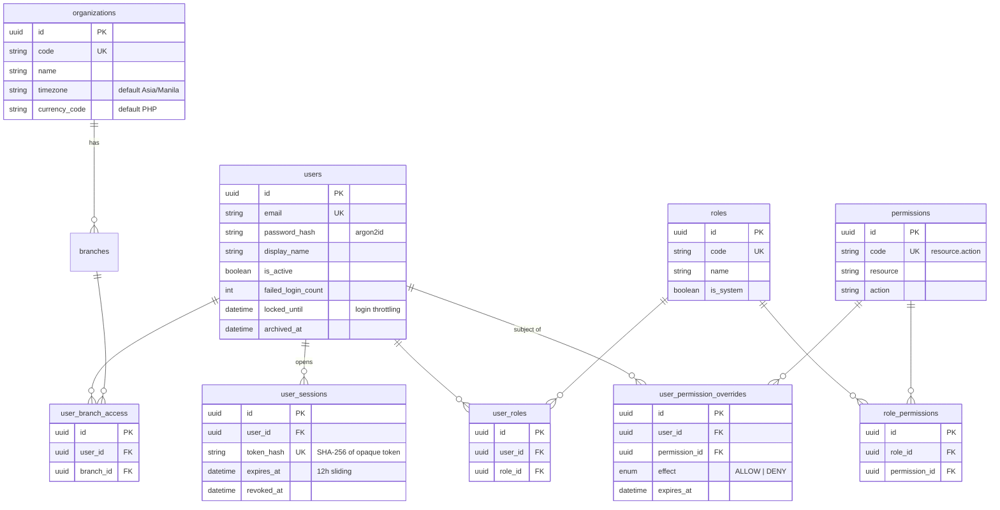
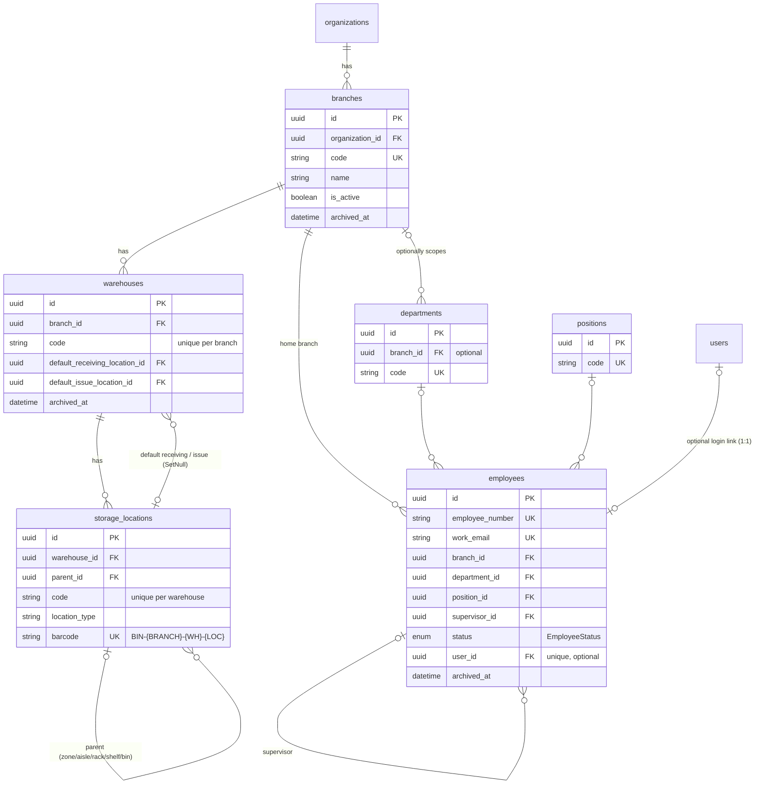
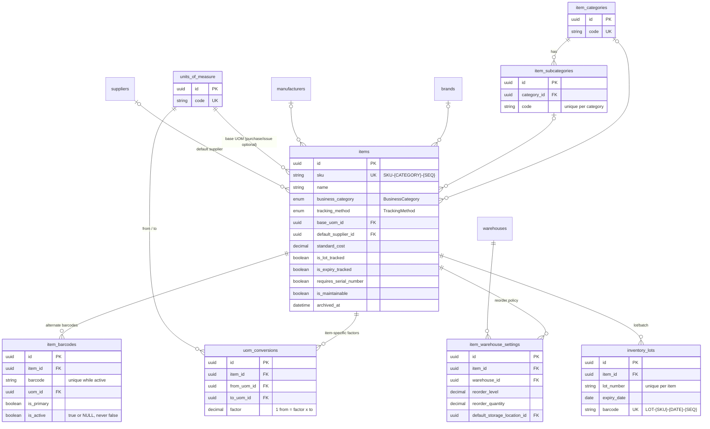
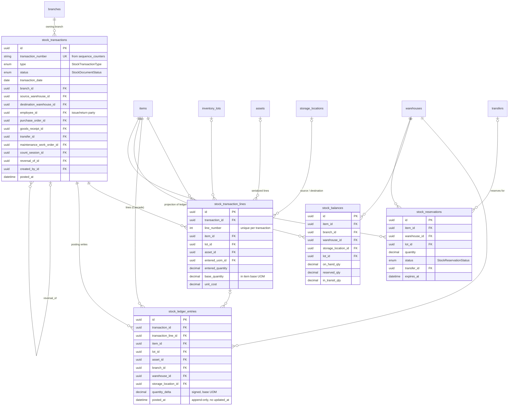
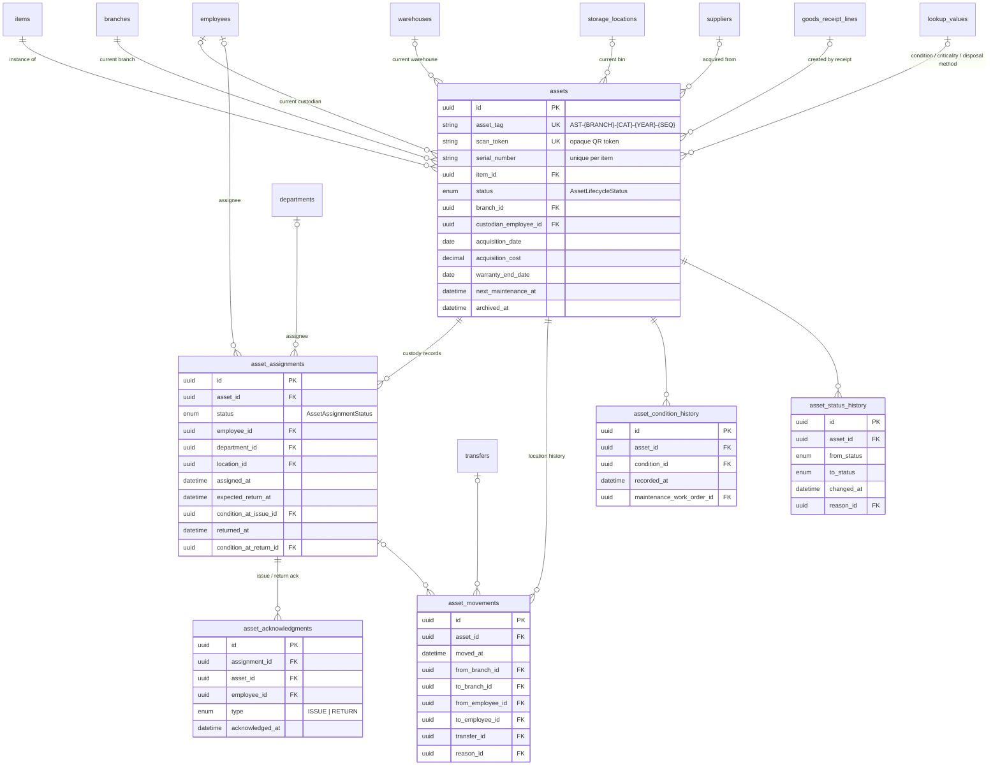
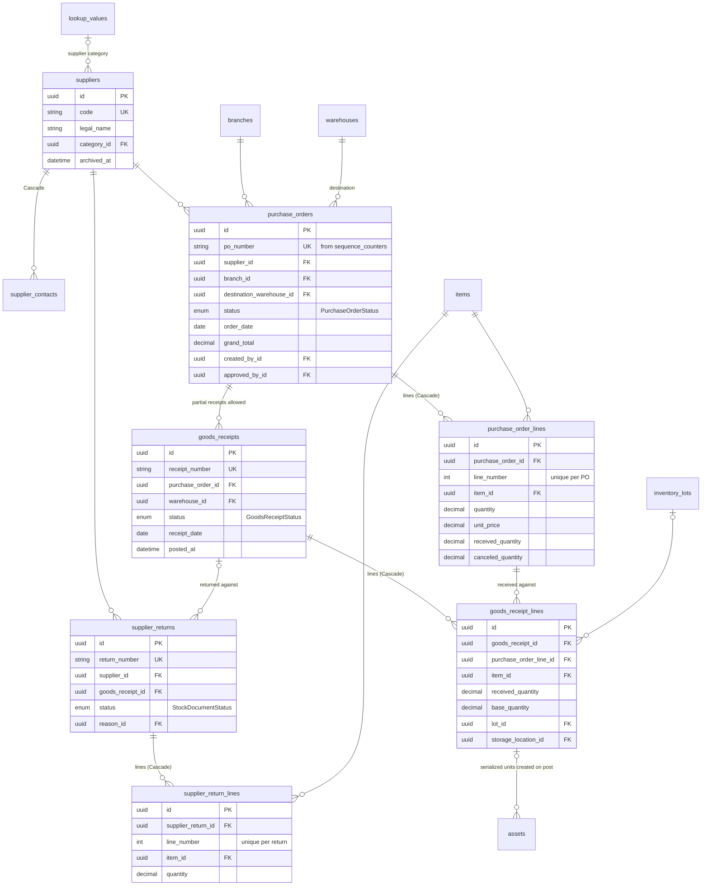
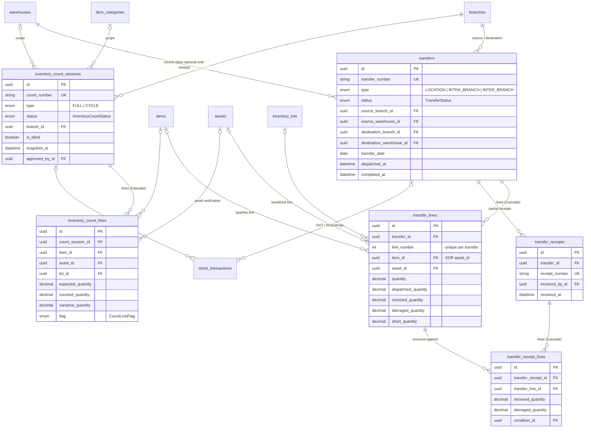
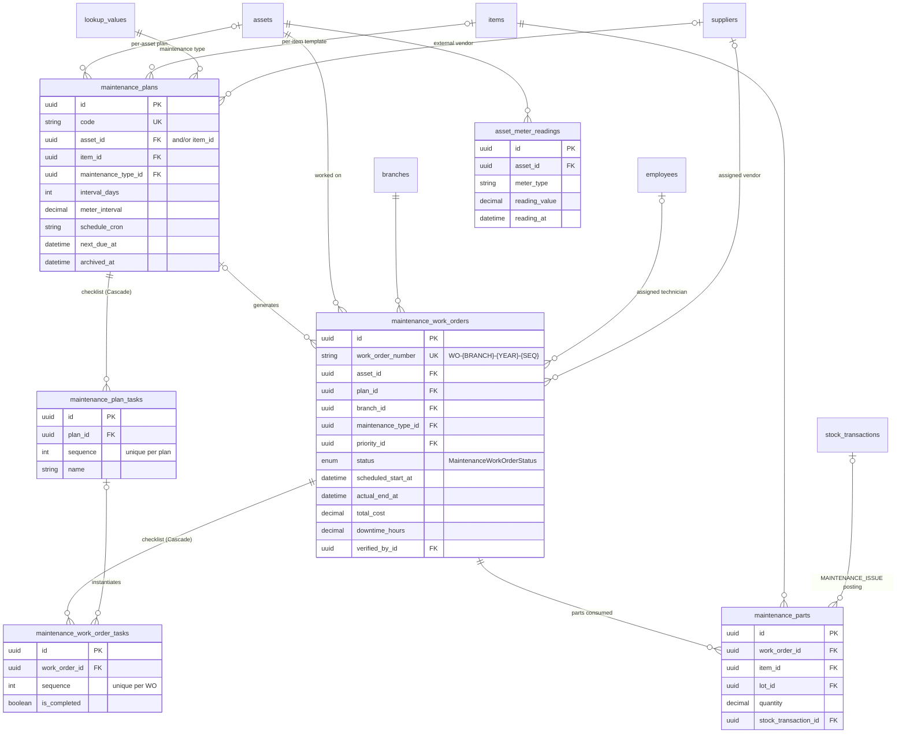
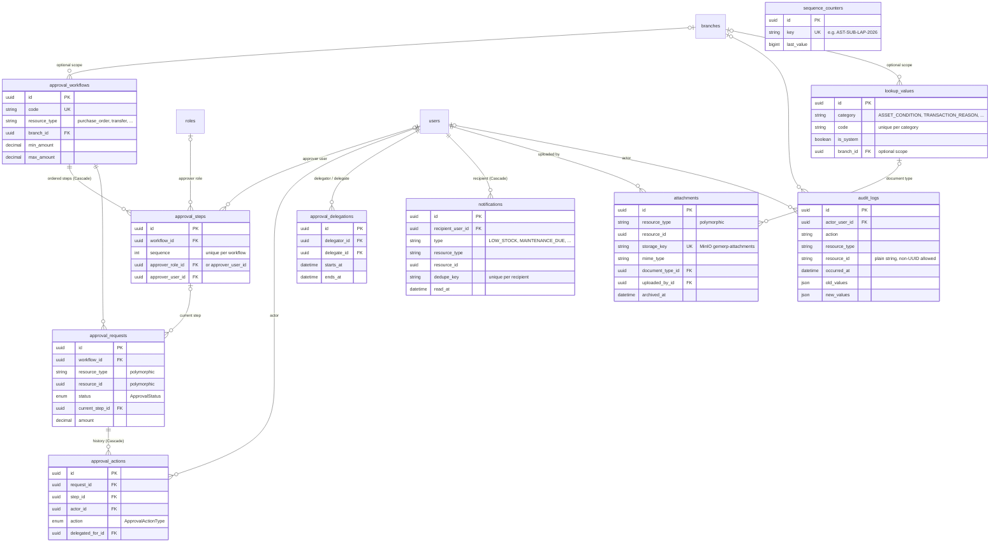

# GEM ERP — Entity-Relationship Design (ERD)

Asset & Inventory Management for GemCor. Single company, multi-branch.

**Source of truth:** `packages/database/prisma/schema.prisma` (66 models, 20 enums).
This document is generated from that schema and must be kept in sync with it. The
schema realizes the "Suggested Core Data Model" of the master spec
(`asset-inventory-system-codex-master-prompt.md`, section 26); deviations are listed
in [Gaps to address](#11-gaps-to-address).

## Schema-wide conventions

- **Primary keys:** UUID everywhere — `@id @default(uuid()) @db.Uuid`. Business
  document numbers (PO number, asset tag, transaction number, ...) come from
  `sequence_counters`, never from the PK.
- **Naming:** snake_case table names via `@@map`, snake_case columns via `@map`.
- **Money:** `Decimal(14, 2)`. **Quantities:** `Decimal(14, 4)`.
- **Enums** exist only for true invariants (document statuses, asset lifecycle,
  tracking method, business category, transaction types, approval states). All
  business-managed vocabularies (conditions, reasons, maintenance types,
  priorities, supplier categories, document types, ...) live in `lookup_values`
  and are referenced by FK with `onDelete: Restrict`.
- **FK delete behavior:** `Restrict` by default; `Cascade` only for pure child
  rows (document lines, join tables, contacts, per-item settings); `SetNull`
  only for optional convenience pointers (e.g. warehouse default locations).
- **Archival:** master data carries `is_active` and/or `archived_at` — soft
  archive, never hard delete of referenced records. Ledger/audit tables are
  append-only. Documents are never deleted; they end life in a terminal status
  (`CANCELED`, `REVERSED`, `CLOSED`, ...).
- **Time:** all timestamps stored in UTC; org display timezone Asia/Manila.
  Default currency PHP.

---

## 1. Identity and access

Tables: `organizations`, `users`, `user_sessions`, `roles`, `permissions`,
`role_permissions`, `user_roles`, `user_branch_access`, `user_permission_overrides`.

## 2. Organization structure and employees

Tables: `branches`, `warehouses`, `storage_locations`, `departments`,
`positions`, `employees`.

## 3. Catalog and inventory

### 3.1 Item master and catalog

Tables: `item_categories`, `item_subcategories`, `brands`, `manufacturers`,
`units_of_measure`, `uom_conversions`, `items`, `item_barcodes`,
`item_warehouse_settings`, `inventory_lots`.

### 3.2 Inventory ledger

Tables: `stock_transactions`, `stock_transaction_lines`, `stock_ledger_entries`,
`stock_balances`, `stock_reservations`. See section
[9. Ledger integrity](#9-ledger-integrity) for the posting contract.

## 4. Serialized assets

Tables: `assets`, `asset_assignments`, `asset_movements`,
`asset_condition_history`, `asset_status_history`, `asset_acknowledgments`.
(`asset_meter_readings` is drawn with maintenance in section 7, matching spec
grouping.)

## 5. Procurement

Tables: `suppliers`, `supplier_contacts`, `purchase_orders`,
`purchase_order_lines`, `goods_receipts`, `goods_receipt_lines`,
`supplier_returns`, `supplier_return_lines`.

## 6. Transfers and physical counts

Tables: `transfers`, `transfer_lines`, `transfer_receipts`,
`transfer_receipt_lines`, `inventory_count_sessions`, `inventory_count_lines`.

## 7. Maintenance

Tables: `maintenance_plans`, `maintenance_plan_tasks`,
`maintenance_work_orders`, `maintenance_work_order_tasks`, `maintenance_parts`,
`asset_meter_readings`.

## 8. Workflow and system

Tables: `approval_workflows`, `approval_steps`, `approval_requests`,
`approval_actions`, `approval_delegations`, `notifications`, `attachments`,
`audit_logs`, `lookup_values`, `sequence_counters`.

---

## Table-by-table reference

FK delete behavior is `Restrict` unless stated; "Cascade child" means the row is
deleted with its parent. Archival legend:

- **soft-archive** — `is_active` and/or `archived_at`; never hard-deleted while referenced.
- **append-only** — never updated or deleted after creation.
- **status-terminal** — document kept forever; ends in a terminal status.
- **child** — lives and dies with its parent document/master row.

### Identity and access

| Table | Purpose | Constraints / uniques / indexes | Archival |
|---|---|---|---|
| `organizations` | Single-company root ("GemCor"); org timezone (Asia/Manila) and currency (PHP). | `code` unique. | soft-archive (`is_active`). |
| `users` | Login accounts. Password argon2id; lockout counters for 5-failure/15-min throttling. | `email` unique; index `is_active`. | soft-archive (`is_active`, `archived_at`). |
| `user_sessions` | Server-side cookie sessions; stores only SHA-256 hash of the opaque 256-bit token; 12h sliding expiry. | `token_hash` unique; indexes `user_id`, `expires_at`. Cascade on user delete. | rows expire (`expires_at`) or are revoked (`revoked_at`); purgeable. |
| `roles` | Role catalog (7 seeded roles; `is_system` protects them). | `code` unique. | soft-archive (`is_active`). |
| `permissions` | Permission catalog, dot-notation codes (`asset.view`, `procurement.po.create`). | `code` unique; index `resource`. | permanent catalog; seed-synced. |
| `role_permissions` | Role↔permission join. | unique `(role_id, permission_id)`; Cascade child of both. | child. |
| `user_roles` | User↔role join. | unique `(user_id, role_id)`; Cascade child of both. | child. |
| `user_branch_access` | Branch scope per user. | unique `(user_id, branch_id)`; Cascade on user, Restrict on branch. | child of user. |
| `user_permission_overrides` | Audited per-user ALLOW/DENY on top of roles; optional expiry. | unique `(user_id, permission_id)`; `effect` enum; Cascade on user/permission, Restrict on `created_by`. | child of user; time-boxed via `expires_at`. |

### Organization structure and employees

| Table | Purpose | Constraints / uniques / indexes | Archival |
|---|---|---|---|
| `branches` | Physical branches (SUB/MKT). | `code` globally unique; indexes `organization_id`, `is_active`. | soft-archive. |
| `warehouses` | Warehouses within a branch; optional default receiving/issue locations (`SetNull`). | unique `(branch_id, code)`; indexes `branch_id`, `is_active`. | soft-archive. |
| `storage_locations` | Nested zone/aisle/rack/shelf/bin tree (self-FK `parent_id`); bins may carry their own barcode. | unique `(warehouse_id, code)`; `barcode` unique (nullable); indexes `warehouse_id`, `parent_id`. | soft-archive. |
| `departments` | Departments, optionally branch-scoped (`branch_id` nullable). | `code` globally unique; index `branch_id`. | soft-archive. |
| `positions` | Job positions. | `code` unique. | soft-archive. |
| `employees` | Custody-only employee records (no HRIS/payroll); optional 1:1 link to a login user; self-FK supervisor. | `employee_number` unique; `work_email` unique (nullable); `user_id` unique (nullable, `SetNull`); indexes `branch_id`, `department_id`, `status`, `(last_name, first_name)`. | soft-archive + `status` (`EmployeeStatus`); `separation_date`. |

### Catalog

| Table | Purpose | Constraints / uniques / indexes | Archival |
|---|---|---|---|
| `item_categories` | Top-level item categories (drive SKU/asset-tag prefixes). | `code` unique. | soft-archive. |
| `item_subcategories` | Second level under a category. | unique `(category_id, code)`. | soft-archive. |
| `brands` / `manufacturers` | Brand and manufacturer masters. | `code` unique each. | soft-archive. |
| `units_of_measure` | UOM catalog (PIECE, BOX, LITER, ...). | `code` unique. | soft-archive (`is_active` only). |
| `uom_conversions` | Item-specific conversion: 1 `from_uom` = `factor` × `to_uom`. | unique `(item_id, from_uom_id, to_uom_id)`; Cascade child of item. | child. |
| `items` | Item master. `business_category` + `tracking_method` enums decide serialized vs quantity vs lot handling; flags for lot/expiry/serial/maintainable; base/purchase/issue UOMs; default supplier; standard & last purchase cost. | `sku` unique; indexes `business_category`, `tracking_method`, `category_id`, `default_supplier_id`, `is_active`, `name`. | soft-archive. |
| `item_barcodes` | Alternate barcodes (supplier/UPC/EAN/packaging), optionally UOM-specific. **Unique-while-active pattern:** `is_active` is `true` for live rows and `NULL` (never `false`) once deactivated, so unique `(barcode, is_active)` allows one active mapping system-wide plus unlimited deactivated duplicates. | unique `(barcode, is_active)`; indexes `item_id`, `barcode`; Cascade child of item. | deactivate (`is_active` → NULL, `deactivated_at`); history kept. |
| `item_warehouse_settings` | Per-warehouse reorder policy (reorder level/qty, min/max, default bin) used by low-stock alerts. | unique `(item_id, warehouse_id)`; Cascade on item, `SetNull` default location. | child of item. |
| `inventory_lots` | Lot/batch records for lot-controlled items; expiry tracked here. | unique `(item_id, lot_number)`; `barcode` unique (nullable); index `expiry_date`. | soft-archive (`is_active`); referenced by ledger forever. |

### Inventory ledger

| Table | Purpose | Constraints / uniques / indexes | Archival |
|---|---|---|---|
| `stock_transactions` | Controlled stock document (15 types, see `StockTransactionType`). Workflow status `StockDocumentStatus`; only `POSTED` documents affect stock. Carries context FKs to employee/department/supplier/PO/GR/transfer/work-order/count-session and a `reversal_of` self-FK. Actor + timestamp pairs for create/submit/approve/post/cancel/reverse. | `transaction_number` unique; indexes `type`, `status`, `transaction_date`, `branch_id`, `posted_at`, and each context FK. | status-terminal; posted documents are immutable, corrected only by `REVERSAL` documents. |
| `stock_transaction_lines` | Document lines; entered qty/UOM plus converted `base_quantity`; optional lot, asset (serialized), source/destination bins, unit cost. | unique `(transaction_id, line_number)`; indexes `item_id`, `lot_id`, `asset_id`; Cascade child of transaction. | child (immutable once parent is posted). |
| `stock_ledger_entries` | **Append-only ledger.** One signed base-quantity delta per item/warehouse/location/lot (and asset) touched by a posted transaction. No `updated_at` column by design. | indexes `(item_id, warehouse_id)`, `(item_id, branch_id)`, `(warehouse_id, storage_location_id)`, `transaction_id`, `lot_id`, `asset_id`, `posted_at`; all FKs Restrict. | append-only, never updated or deleted. |
| `stock_balances` | Transactionally-maintained projection of the ledger: `on_hand_qty`, `reserved_qty`, `in_transit_qty` per item/warehouse/location/lot. Never edited directly. | unique `(item_id, warehouse_id, storage_location_id, lot_id)` — defense in depth only, since Postgres treats NULLs as distinct (see section 9); indexes `warehouse_id`, `branch_id`, `item_id`. | derived; rebuildable from the ledger. |
| `stock_reservations` | Soft holds on quantity stock (e.g. for approved transfers) feeding `reserved_qty`. | indexes `(item_id, warehouse_id)`, `status`, `transfer_id`; `status` enum with `expires_at`/`released_at`. | status-terminal (`RELEASED`/`FULFILLED`/`CANCELED`). |

### Serialized assets

| Table | Purpose | Constraints / uniques / indexes | Archival |
|---|---|---|---|
| `assets` | Physical serialized unit: tag, opaque QR `scan_token` (scanning still requires authn/authz), lifecycle `status`, current branch/warehouse/bin/custodian/department, acquisition + warranty + disposal data, maintenance scheduling fields. Condition/criticality/disposal-method are `lookup_values` FKs. | `asset_tag` unique; `scan_token` unique; unique `(item_id, serial_number)`; indexes `status`, `branch_id`, `warehouse_id`, `custodian_employee_id`, `item_id`, `next_maintenance_at`, `warranty_end_date`. | soft-archive after `RETIRED`/`DISPOSED`; never hard-deleted (history points at it). |
| `asset_assignments` | Custody record per issue: employee, department, location, or project; condition at issue/return; acknowledgment and return tracking. | indexes `asset_id`, `employee_id`, `status`, `expected_return_at`. | status-terminal (`RETURNED`/`LOST`/`CANCELED`); permanent custody history. |
| `asset_movements` | Append-only location/custody movement history (from/to branch, warehouse, location, employee), optionally linked to a transfer or assignment. | indexes `asset_id`, `moved_at`, `transfer_id`. | append-only. |
| `asset_condition_history` | Condition timeline; can originate from a work order (`source` free-text notes origin). | indexes `asset_id`, `recorded_at`. | append-only. |
| `asset_status_history` | Lifecycle transitions `from_status` → `to_status` with reason lookup. | indexes `asset_id`, `changed_at`. | append-only. |
| `asset_acknowledgments` | Employee acknowledgment of issue/return (`type` = `ISSUE`/`RETURN`, capture `method`). | indexes `assignment_id`, `asset_id`, `employee_id`. | append-only. |
| `asset_meter_readings` | Usage meters (hours, km, pages) driving meter-based maintenance. | index `(asset_id, reading_at)`. | append-only. |

### Procurement

| Table | Purpose | Constraints / uniques / indexes | Archival |
|---|---|---|---|
| `suppliers` | Supplier master; category is a `lookup_values` FK; PH-default country. | `code` unique; index `is_active`. | soft-archive. |
| `supplier_contacts` | Contact persons per supplier. | index `supplier_id`; Cascade child of supplier. | child; `is_active` flag. |
| `purchase_orders` | PO header with money totals (subtotal/discount/tax/grand, `Decimal(14,2)`), status workflow, actor/timestamp pairs. | `po_number` unique; indexes `supplier_id`, `branch_id`, `status`, `order_date`. | status-terminal (`CANCELED`/`CLOSED`). |
| `purchase_order_lines` | PO lines with pricing and receiving progress (`received_quantity`, `canceled_quantity`). | unique `(purchase_order_id, line_number)`; index `item_id`; Cascade child of PO. | child. |
| `goods_receipts` | Receipt against an approved PO; supports partial/multiple receipts; stock + serialized assets are created only when `POSTED`. | `receipt_number` unique; indexes `purchase_order_id`, `branch_id`, `status`, `receipt_date`. | status-terminal (`CANCELED`/`REVERSED`). |
| `goods_receipt_lines` | Received quantities per PO line, with lot, bin, and unit cost; back-referenced by `assets.goods_receipt_line_id` for serialized units created on posting. | unique `(goods_receipt_id, line_number)`; indexes `purchase_order_line_id`, `item_id`; Cascade child of receipt (PO-line FK Restrict). | child. |
| `supplier_returns` | Return-to-supplier document (uses `StockDocumentStatus`), optionally tied to the originating goods receipt; reason lookup. | `return_number` unique; indexes `supplier_id`, `branch_id`, `status`. | status-terminal. |
| `supplier_return_lines` | Returned quantities per item/lot. | unique `(supplier_return_id, line_number)`; index `item_id`; Cascade child. | child. |

### Transfers and counts

| Table | Purpose | Constraints / uniques / indexes | Archival |
|---|---|---|---|
| `transfers` | Transfer document — bin-to-bin (`LOCATION`), warehouse-to-warehouse (`INTRA_BRANCH`), or `INTER_BRANCH` with the controlled flow draft → approval → dispatch (`IN_TRANSIT`) → receipt(s) → `RECEIVED`. Destination warehouse/location optional until receipt. | `transfer_number` unique; indexes `status`, `source_branch_id`, `destination_branch_id`, `transfer_date`. | status-terminal. |
| `transfer_lines` | A line is either quantity stock (`item_id` + `quantity`) **or** one serialized asset (`asset_id`) — XOR enforced in the app layer, not the DB. Tracks dispatched/received/damaged/short/rejected quantities. | unique `(transfer_id, line_number)`; indexes `item_id`, `asset_id`; Cascade child of transfer. | child. |
| `transfer_receipts` | Destination-side receipt event (supports partial receipt and inspection). | `receipt_number` unique; index `transfer_id`. | append-only event. |
| `transfer_receipt_lines` | Per-line received/damaged/short/rejected quantities with condition lookup. | index `transfer_line_id`; Cascade child of receipt (transfer-line FK Restrict). | child. |
| `inventory_count_sessions` | Physical (`FULL`) or `CYCLE` count, scoped by branch and optionally warehouse/location/category; blind-count option; snapshot timestamp. Counts never overwrite stock — approved variances generate adjustment `stock_transactions` (back-linked via `count_session_id`). | `count_number` unique; indexes `branch_id`, `warehouse_id`, `status`. | status-terminal. |
| `inventory_count_lines` | Expected vs counted vs recount vs variance per item/lot/bin, or per asset for verification (`flag` = `CountLineFlag`). | indexes `count_session_id`, `item_id`, `asset_id`; Cascade child of session. | child. |

### Maintenance

| Table | Purpose | Constraints / uniques / indexes | Archival |
|---|---|---|---|
| `maintenance_plans` | Preventive-maintenance template for a specific asset and/or every maintainable asset of an item; frequency by `interval_days`, `meter_interval` (+ `meter_type`), or `schedule_cron`; vendor, cost/duration estimates, reminder lead, computed `next_due_at`. | `code` unique; indexes `asset_id`, `item_id`, `is_active`, `next_due_at`. | soft-archive. |
| `maintenance_plan_tasks` | Ordered checklist template. | unique `(plan_id, sequence)`; Cascade child of plan. | child. |
| `maintenance_work_orders` | Corrective/preventive work order: reporting, assignment (employee, vendor, or team), scheduling, diagnosis/action/resolution, labor/parts/external/total cost, downtime, completion condition (lookup), verification. | `work_order_number` unique; indexes `asset_id`, `branch_id`, `status`, `scheduled_start_at`, `assigned_to_employee_id`. | status-terminal (`COMPLETED`/`VERIFIED`/`CANCELED`). |
| `maintenance_work_order_tasks` | Checklist instances (optionally copied from plan tasks). | unique `(work_order_id, sequence)`; Cascade child of WO. | child. |
| `maintenance_parts` | Spare parts consumed by a work order, backed by a posted `MAINTENANCE_ISSUE` stock transaction — parts always move through the inventory ledger. | indexes `work_order_id`, `item_id`; WO FK is Restrict (not Cascade). | kept with the work order. |

### Workflow and system

| Table | Purpose | Constraints / uniques / indexes | Archival |
|---|---|---|---|
| `approval_workflows` | Configurable approval rule per `resource_type` (purchase_order, transfer, stock_transaction, asset_disposal, ...), optionally branch-scoped and amount-banded (`min_amount`–`max_amount`). | `code` unique; indexes `resource_type`, `branch_id`. | soft-archive (`is_active`). |
| `approval_steps` | Ordered steps; approver is a role **or** a named user. | unique `(workflow_id, sequence)`; Cascade child of workflow. | child. |
| `approval_requests` | Running approval for one document — polymorphic `resource_type`/`resource_id`; tracks current step and amount. | indexes `(resource_type, resource_id)`, `status`, `requested_by_id`. | status-terminal (`ApprovalStatus`). |
| `approval_actions` | Full decision history (`APPROVE`/`REJECT`/`RETURN`/`CANCEL`/`COMMENT`); `delegated_for` records the original approver when acting under delegation. | indexes `request_id`, `actor_id`; Cascade child of request. | append-only history. |
| `approval_delegations` | Time-boxed delegation of approval authority between users. | indexes `delegator_id`, `delegate_id`; Cascade on both users. | `is_active` + date window. |
| `notifications` | In-app notifications; `type` is a machine code (LOW_STOCK, PENDING_APPROVAL, MAINTENANCE_DUE, ...); `dedupe_key` prevents duplicate alerts per recipient. | unique `(recipient_user_id, dedupe_key)`; indexes `(recipient_user_id, read_at)`, `type`, `created_at`; Cascade on recipient. | read-tracking; purgeable per retention policy. |
| `attachments` | File metadata; bytes live in MinIO/S3 bucket `gemerp-attachments`. Polymorphic owner; branch scoping enforced in the app layer. | `storage_key` unique; indexes `(resource_type, resource_id)`, `branch_id`. | soft-archive (`archived_at`). |
| `audit_logs` | **Append-only** audit trail. No `updated_at` by design. `resource_id` is a plain string so non-UUID identifiers (e.g. permission codes) can be referenced. Old/new values as JSON; secrets redacted by the writer. | indexes `actor_user_id`, `action`, `(resource_type, resource_id)`, `branch_id`, `occurred_at`. | append-only; retention policy TBD. |
| `lookup_values` | Business-managed configurable vocabularies keyed by `category` (ASSET_CONDITION, TRANSACTION_REASON, ADJUSTMENT_REASON, DISPOSAL_METHOD, MAINTENANCE_TYPE, MAINTENANCE_PRIORITY, SUPPLIER_CATEGORY, DOCUMENT_TYPE, ASSET_CRITICALITY, NOTIFICATION_TYPE, ...); optionally branch-scoped; `is_system` protects seeded values. All referencing FKs are Restrict — deactivate, never delete. | unique `(category, code)`; indexes `(category, is_active)`, `branch_id`. | soft-archive (`is_active`). |
| `sequence_counters` | Named counters for business document numbers (asset tags, PO numbers, transaction numbers). Keys embed scope+period, e.g. `AST-SUB-LAP-2026`, `PO-2026`, `TRF-2026`. | `key` unique; `last_value` BigInt. | permanent. |

---

## 9. Ledger integrity

The inventory subsystem is event-sourced at its core. Three tables carry the
contract; every service that touches stock must honor it.

### `stock_ledger_entries` — immutable event log

- The ledger is **append-only**: rows are never updated or deleted. The model
  deliberately has no `updated_at` column.
- Only a `stock_transactions` row reaching `POSTED` writes ledger rows, and the
  ledger rows are created **in the same database transaction** as the status
  flip to `POSTED`. A document is either fully posted (all deltas written) or
  not posted at all.
- Each row is one signed `quantity_delta` in the item's **base UOM** for one
  `(item, branch, warehouse, storage_location?, lot?, asset?)` slot; line-level
  provenance via `transaction_line_id`.
- Mistakes are corrected with `REVERSAL` transactions (type `REVERSAL`, header
  `reversal_of_id` pointing at the original), which append compensating
  entries. Posted history is never edited.
- All ledger FKs are `onDelete: Restrict`, so no referenced master row (item,
  lot, asset, branch, warehouse, location) can ever be hard-deleted out from
  under history — masters are archived instead.
- Prisma cannot express "no UPDATE/DELETE" at the DB level; the migration layer
  should add a belt-and-braces guard (revoke UPDATE/DELETE from the app role
  or a raising trigger). Until then it is an application-layer invariant.

### `stock_balances` — derived projection

- `stock_balances` is a **projection** of the ledger: `on_hand_qty` per
  `(item, warehouse, storage_location?, lot?)` slot must always equal the sum
  of `quantity_delta` for that slot. `reserved_qty` mirrors active
  `stock_reservations`; `in_transit_qty` mirrors dispatched-not-yet-received
  transfer quantity.
- The posting service upserts the balance row **inside the same serialized
  transaction** as the ledger write, using `SELECT ... FOR UPDATE` on the
  balance row to prevent lost updates under concurrency. Negative-stock and
  reservation checks happen under that same lock.
- The unique constraint `(item_id, warehouse_id, storage_location_id, lot_id)`
  is defense in depth only: Postgres treats NULLs as distinct in unique
  constraints, so slots with NULL location/lot are not fully protected by the
  constraint — correctness rests on the serialized upsert.
- Because it is derived, `stock_balances` is rebuildable at any time by
  re-aggregating `stock_ledger_entries`; a reconciliation job should compare
  the two and alarm on drift.

### `sequence_counters` — human-readable document numbering

- Every business number (asset tag `AST-{BRANCH}-{CAT}-{YEAR}-{SEQ}`, PO
  number, transaction number, transfer number, count number, WO number, lot
  barcodes, ...) is generated from a named counter row — **never** from the
  UUID primary key.
- Counter keys embed the scope and period (e.g. `AST-SUB-LAP-2026`,
  `PO-2026`, `TRF-2026`), so sequences reset per year/prefix by key
  convention, not by resetting rows.
- Increment protocol: `SELECT ... FOR UPDATE` (or an atomic
  `UPDATE ... SET last_value = last_value + 1 ... RETURNING`) **inside the
  same transaction that creates the document**, guaranteeing no duplicate
  numbers under concurrency. A rolled-back transaction may leave a gap in the
  sequence; gaps are acceptable, duplicates are not.
- `last_value` is `BigInt`; the formatted number is derived (zero-padded) by
  the numbering service.

Related integrity notes:

- `audit_logs` follows the same append-only discipline as the ledger (no
  `updated_at`, never updated or deleted).
- Asset history tables (`asset_movements`, `asset_status_history`,
  `asset_condition_history`, `asset_acknowledgments`, `asset_meter_readings`)
  are append-only by convention.
- Serialized assets also flow through the ledger: serialized stock transaction
  lines carry `asset_id`, and their ledger entries move quantity 1 of the
  asset's item, keeping quantity truth and asset truth reconciled.

---

## 10. Enum inventory

All Prisma enums and their values, verbatim from the schema. Everything not
listed here (conditions, reasons, priorities, types, categories of suppliers,
document types, ...) is a `lookup_values` category, not an enum.

| Enum | Values | Used by |
|---|---|---|
| `BusinessCategory` | `SERIALIZED_ASSET`, `CONSUMABLE`, `BULK_NON_CONSUMABLE` | `items.business_category` |
| `TrackingMethod` | `SERIAL`, `QUANTITY`, `LOT` | `items.tracking_method` |
| `AssetLifecycleStatus` | `DRAFT`, `AVAILABLE`, `RESERVED`, `ASSIGNED`, `IN_TRANSFER`, `UNDER_INSPECTION`, `UNDER_MAINTENANCE`, `DAMAGED`, `LOST`, `RETIRED`, `DISPOSED` | `assets.status`, `asset_status_history.from_status` / `to_status` |
| `StockTransactionType` | `OPENING_BALANCE`, `PURCHASE_RECEIPT`, `NON_PURCHASE_RECEIPT`, `ISSUE_TO_EMPLOYEE`, `ISSUE_TO_DEPARTMENT`, `RETURN_FROM_EMPLOYEE`, `RETURN_TO_SUPPLIER`, `LOCATION_TRANSFER`, `INTER_BRANCH_TRANSFER_OUT`, `INTER_BRANCH_TRANSFER_IN`, `ADJUSTMENT_INCREASE`, `ADJUSTMENT_DECREASE`, `MAINTENANCE_ISSUE`, `DISPOSAL`, `REVERSAL` | `stock_transactions.type` |
| `StockDocumentStatus` | `DRAFT`, `PENDING_APPROVAL`, `APPROVED`, `REJECTED`, `POSTED`, `CANCELED`, `REVERSED` | `stock_transactions.status`, `supplier_returns.status` |
| `PurchaseOrderStatus` | `DRAFT`, `PENDING_APPROVAL`, `APPROVED`, `REJECTED`, `PARTIALLY_RECEIVED`, `FULLY_RECEIVED`, `CANCELED`, `CLOSED` | `purchase_orders.status` |
| `GoodsReceiptStatus` | `DRAFT`, `POSTED`, `CANCELED`, `REVERSED` | `goods_receipts.status` |
| `TransferType` | `LOCATION`, `INTRA_BRANCH`, `INTER_BRANCH` | `transfers.type` |
| `TransferStatus` | `DRAFT`, `PENDING_APPROVAL`, `APPROVED`, `REJECTED`, `IN_TRANSIT`, `PARTIALLY_RECEIVED`, `RECEIVED`, `CANCELED` | `transfers.status` |
| `InventoryCountType` | `FULL`, `CYCLE` | `inventory_count_sessions.type` |
| `InventoryCountStatus` | `DRAFT`, `IN_PROGRESS`, `REVIEW`, `COMPLETED`, `CANCELED` | `inventory_count_sessions.status` |
| `CountLineFlag` | `MATCHED`, `VARIANCE`, `MISSING`, `UNEXPECTED`, `DUPLICATE`, `MISPLACED` | `inventory_count_lines.flag` |
| `MaintenanceWorkOrderStatus` | `DRAFT`, `OPEN`, `ASSIGNED`, `SCHEDULED`, `IN_PROGRESS`, `ON_HOLD`, `AWAITING_PARTS`, `AWAITING_VENDOR`, `COMPLETED`, `VERIFIED`, `CANCELED` | `maintenance_work_orders.status` |
| `ApprovalStatus` | `PENDING`, `APPROVED`, `REJECTED`, `RETURNED`, `CANCELED` | `approval_requests.status` |
| `ApprovalActionType` | `APPROVE`, `REJECT`, `RETURN`, `CANCEL`, `COMMENT` | `approval_actions.action` |
| `EmployeeStatus` | `ACTIVE`, `INACTIVE`, `SUSPENDED`, `SEPARATED` | `employees.status` |
| `AssetAssignmentStatus` | `PENDING_ACKNOWLEDGMENT`, `ACTIVE`, `RETURNED`, `LOST`, `CANCELED` | `asset_assignments.status` |
| `AcknowledgmentType` | `ISSUE`, `RETURN` | `asset_acknowledgments.type` |
| `PermissionOverrideEffect` | `ALLOW`, `DENY` | `user_permission_overrides.effect` |
| `StockReservationStatus` | `ACTIVE`, `RELEASED`, `FULFILLED`, `CANCELED` | `stock_reservations.status` |

---

## 11. Gaps to address

### Spec section 26 coverage

**Every table named in spec section 26 exists in the schema** — all 63 listed
tables are present under their exact snake_case names. Nothing is missing.

### Additions beyond the spec section 26 list

The schema adds three tables the spec's list did not name explicitly (all are
natural completions of spec-described behavior, not new features):

| Table | Why it exists |
|---|---|
| `supplier_return_lines` | Line detail for `supplier_returns` (the spec listed only the header). |
| `transfer_receipt_lines` | Per-line received/damaged/short/rejected detail under `transfer_receipts`, required for partial-receipt and inspection outcomes (spec section 16). |
| `approval_delegations` | Time-boxed approval delegation, required by spec section 19 ("Delegation with start and end dates"); `approval_actions.delegated_for_id` records acting-on-behalf-of. |

Note: `asset_meter_readings` is listed in spec section 26 under Maintenance and
exists in the schema (its model sits in the serialized-assets block of
`schema.prisma`; this document draws it in the maintenance diagram to match the
spec grouping).

### Invariants the database cannot enforce (application-layer duties)

These are correct-by-construction in the services, but reviewers should know
the DB alone does not guarantee them:

1. **Ledger/audit immutability** — Prisma cannot forbid UPDATE/DELETE on
   `stock_ledger_entries` / `audit_logs`; add a migration-level trigger or
   role-privilege revoke as hardening.
2. **`stock_balances` slot uniqueness with NULLs** — Postgres NULL-distinct
   semantics weaken the unique constraint; the serialized `SELECT ... FOR
   UPDATE` upsert in the posting service is the real guarantee.
3. **XOR line shapes** — `transfer_lines` (item+quantity vs. asset) and
   `maintenance_plans` (asset and/or item), `approval_steps` (role vs. user)
   have optional-FK pairs whose validity rules live in validation code, not
   CHECK constraints.
4. **Status machines** — enum columns list the states; legal transitions
   (documented in `docs/status-transitions.md`) are service-enforced.
5. **Branch scoping of polymorphic rows** — `attachments` and
   `approval_requests` reference documents polymorphically
   (`resource_type`/`resource_id`, no FK); referential integrity and branch
   scoping for them are app-enforced.
