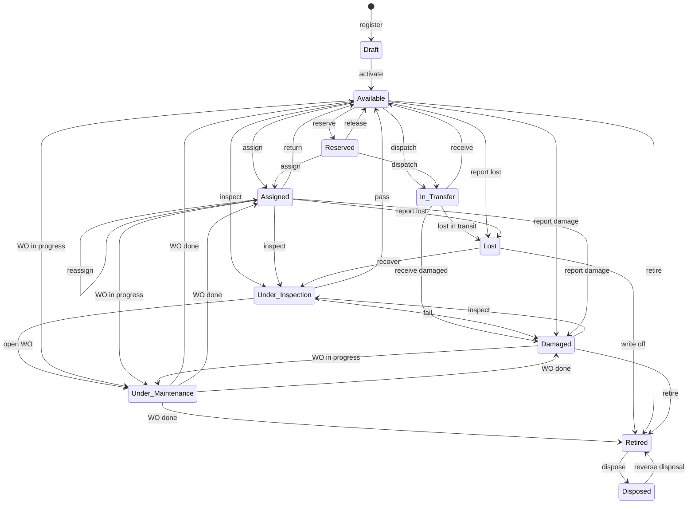
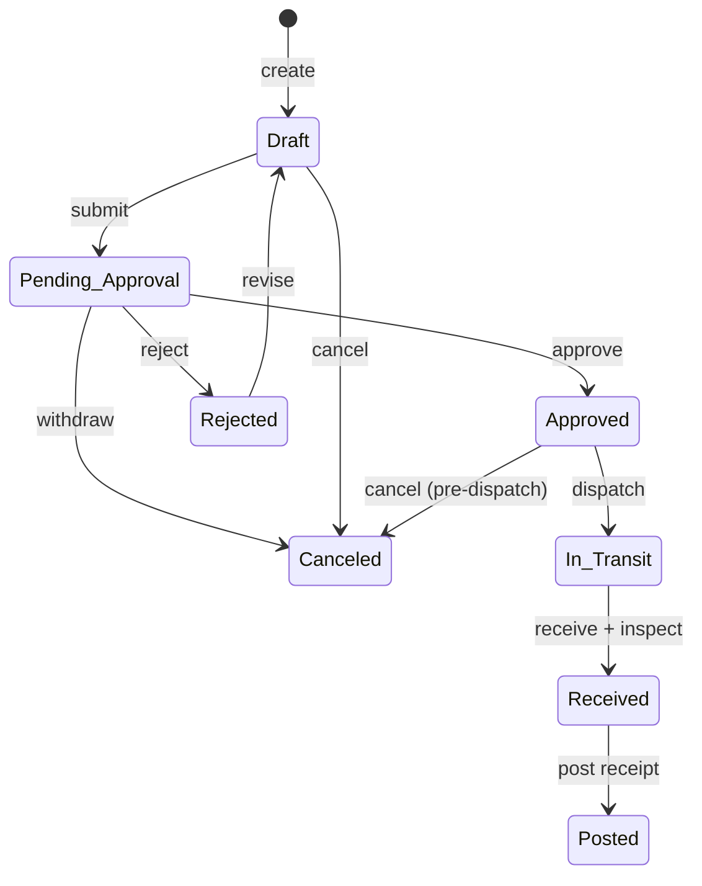

# GEM ERP — Status Transition Reference

Canonical state machines for every stateful document and record in GEM ERP
(Asset & Inventory Management for GEM Cor). This document is the contract that
`apps/api` services, `packages/database` enums/check constraints, and
`apps/web` UI action menus must implement. It is derived from the master spec
(`asset-inventory-system-codex-master-prompt.md`), primarily sections 12
(asset lifecycle), 13 (stock transactions), 14 (procurement), 16 (transfers),
17 (counts), 18 (maintenance), 19 (approvals), and 25 (reason capture).

## Conventions

- **Events, not PATCHes.** Status is never mutated directly by a generic
  update endpoint. Every transition is a named event exposed as a dedicated
  action (e.g. `POST /purchase-orders/:id/submit`). Illegal events return the
  standard error envelope with code `INVALID_STATUS_TRANSITION`.
- **Enforcement in one place.** Each domain service owns a transition map
  (`from -> event -> to`) checked inside the same database transaction that
  performs side effects. The database stores status as an enum-backed column;
  history tables (`asset_status_history`, approval/audit records) capture
  every change with actor, timestamp (UTC), and reason.
- **Permissions** are the dot-notation strings from `@gemerp/shared`
  `PERMISSIONS` (spec section 8). Strings shown here that go beyond the
  spec's verbatim examples are part of the completed permission matrix; see
  [Appendix A](#appendix-a--permission-strings-referenced).
- **Approval column.** "Yes" means the transition is executed through the
  configurable approval framework (spec section 19): a matching
  `approval_workflow` routes the document, and the *approve*/*reject* events
  additionally require the actor to be the resolved approver of the current
  step. A requester can never approve their own document unless an explicit,
  audited override permits it. Where no workflow matches (type/threshold not
  configured), submit auto-advances to Approved.
- **Reason column.** "Yes" means a reason code (lookup value) and/or comment
  is mandatory and persisted. Per spec section 25, reason capture is always
  required for adjustments, reversals, cancellations, disposal, loss, and
  damage; section 19 requires comments on every rejection.
- **Branch scope** applies to every event: the actor must have branch access
  covering the record's branch (both source and destination branches for
  transfers). This guard is implied everywhere and not repeated per row.
- **Audit.** Every transition is audit-logged (spec section 22) with old/new
  values, actor, and reason. No transition can bypass audit logging.

---

## 1. Asset lifecycle (serialized assets)

States (spec section 12): `Draft`, `Available`, `Reserved`, `Assigned`,
`In Transfer`, `Under Inspection`, `Under Maintenance`, `Damaged`, `Lost`,
`Retired`, `Disposed`.

### 1.1 Transition table

| Current state | Event / action | Next state | Required permission | Guard conditions | Approval | Reason code |
|---|---|---|---|---|---|---|
| — | `register` | Draft | `asset.create` | Item Master entry exists with serialized tracking; branch in actor scope | No | No |
| Draft | `activate` | Available | `asset.update` | Asset tag unique and printed/assigned; item, branch, warehouse/storage location set; required fields complete | No | No |
| Draft | `archive-draft` | (archived) | `asset.update` | No history, movements, or document links exist | No | No |
| Available | `reserve` | Reserved | `asset.reserve` | Reservation is linked to a pending assignment, approved transfer, or scheduled work order; no open WO in progress | No | No |
| Reserved | `release-reservation` | Available | `asset.reserve` | Linked document canceled/rejected or reservation expired | No | No |
| Available, Reserved | `assign` | Assigned | `asset.assign` | Custodian employee is active; condition at issuance captured; acknowledgment record created (employee confirms or captured form); if from Reserved, assignment matches the reservation | No | No |
| Assigned | `reassign` | Assigned | `asset.assign` | New custodian active; movement + condition recorded; prior custodian's acknowledgment of hand-over captured | No | No |
| Assigned | `return` | Available | `asset.assign` | Condition at return captured; return location set; if returned condition is failed/damaged use `return-damaged` instead | No | No |
| Assigned | `return-damaged` | Damaged | `asset.assign` | Condition captured; damage declaration created and approved | Yes (damage declaration) | Yes |
| Available, Reserved, Assigned | `report-damage` | Damaged | `asset.report_incident` | Damage declaration approved; photos/notes attached where available; any active reservation released; active assignment closed with condition record | Yes (damage declaration) | Yes |
| Available, Assigned, In Transfer | `report-lost` | Lost | `asset.report_incident` | Loss declaration approved; active assignment closed and flagged (not marked "returned"); if In Transfer, transfer line resolved as lost | Yes (loss declaration) | Yes |
| Available, Assigned, Damaged | `send-to-inspection` | Under Inspection | `asset.inspect` | Not In Transfer; typically triggered by return, count verification, or incident review | No | No |
| Under Inspection | `inspection-pass` | Available | `asset.inspect` | Condition recorded; last-inspection date updated | No | No |
| Under Inspection | `inspection-fail` | Damaged | `asset.inspect` | Condition + findings recorded; maintenance-required flag may be set | No | Yes |
| Under Inspection | `open-work-order` | Under Maintenance | `maintenance.work_order.manage` | Work order created and In Progress for this asset | No | No |
| Available, Assigned, Damaged | `maintenance-start` | Under Maintenance | `maintenance.work_order.manage` | Linked WO enters In Progress; asset is not In Transfer, Lost, Retired, or Disposed; item is maintenance-eligible | No | No |
| Under Maintenance | `maintenance-complete` | Available \| Assigned \| Damaged \| Retired | `maintenance.work_order.manage` (+ `asset.retire` when outcome is Retired) | WO Completed; final condition recorded; outcome status chosen explicitly (spec §18); outcome Assigned only if the pre-maintenance assignment is still active; outcome Retired routes through the retirement approval | Only for Retired outcome | Yes for Damaged/Retired outcome |
| Under Maintenance | `work-order-canceled` | (status before WO) | `maintenance.work_order.manage` | WO Canceled with reason; asset reverts to the status it held when the WO started | No | Yes (WO cancel reason) |
| Available, Reserved | `dispatch` | In Transfer | `asset.transfer` | Approved inter-branch/inter-warehouse transfer is dispatched; asset is not Under Maintenance and has no open WO; Assigned assets must be returned or reassigned before dispatch | Via transfer document | No |
| In Transfer | `receive` | Available | `asset.transfer` | Transfer receipt posted at destination; destination branch/warehouse/location written; inspection at receipt passed | No | No |
| In Transfer | `receive-damaged` | Damaged | `asset.transfer` | Damage recorded on the transfer receipt line; damage declaration raised | Yes (damage declaration) | Yes |
| In Transfer | `lost-in-transit` | Lost | `asset.report_incident` | Loss declaration approved; transfer line resolved as lost/short | Yes (loss declaration) | Yes |
| Lost | `recover` | Under Inspection | `asset.recover` | Authorized recovery workflow approved (spec §12: a lost asset can never return to Available without it); inspection determines final state | Yes (recovery) | Yes |
| Lost | `write-off` | Retired | `asset.retire` | Write-off approved; retirement date set | Yes (retirement/write-off) | Yes |
| Damaged | `send-to-repair` | Under Maintenance | `maintenance.work_order.manage` | Corrective WO created and In Progress | No | No |
| Available, Damaged | `retire` | Retired | `asset.retire` | Not Assigned/Reserved/In Transfer; no open WO (complete or cancel first); retirement date recorded | Yes (asset retirement) | Yes |
| Retired | `dispose` | Disposed | `asset.dispose` | Disposal approved; disposal method (lookup), date, and details recorded; supporting documents attached | Yes (disposal) | Yes |
| Disposed | `reverse-disposal` | Retired | `asset.dispose` | Authorized reversal only (spec §12: a posted disposal can never be deleted); reversal reason + approval recorded; original disposal record retained | Yes (reversal) | Yes |
| Retired | `reinstate` | Available | `asset.retire` | Explicitly approved reinstatement; condition re-inspected — see open questions | Yes | Yes |

### 1.2 Forbidden transitions (must be rejected with `INVALID_STATUS_TRANSITION`)

Per spec section 12, plus the closure of the table above:

| Forbidden | Why |
|---|---|
| Disposed → anything except `reverse-disposal` → Retired | A disposed asset cannot be assigned, transferred, maintained, or reactivated; disposal records cannot be deleted |
| Under Maintenance → In Transfer / Assigned / Reserved | An asset under maintenance cannot be transferred, issued, or reserved until its WO is Completed or Canceled |
| Lost → Available (direct) | Recovery must go through the authorized recovery workflow and inspection |
| Lost → Assigned / Reserved / In Transfer | A lost asset cannot participate in any operation |
| Draft → any state other than Available (or draft archival) | Drafts must be activated before use |
| Damaged → Assigned (direct) | A damaged asset must pass inspection or repair before it can be issued |
| Retired → Assigned / Reserved / In Transfer | Retired assets are out of service; only `dispose` or the gated `reinstate` apply |
| Assigned → In Transfer (direct) | Custody must be returned/reassigned before an inter-branch dispatch |
| Deleting a posted disposal, retirement, or any posted movement | Append-only history; corrections are authorized reversals |
| Auto-returning assets on employee separation | Separation flow lists outstanding assets; each requires an explicit return/loss/damage event (spec §15) |

---

## 2. Stock transaction documents

Applies to every transaction type in spec section 13 (opening balance,
purchase receipt, non-purchase receipt, issues, returns, location transfer,
inter-branch transfer legs, adjustments, maintenance-parts issue,
disposal/write-off, reversal).

States: `Draft`, `Pending Approval`, `Approved`, `Rejected`, `Posted`,
`Canceled`, `Reversed`. **Only `Posted` affects stock** — ledger entries and
balances are written exclusively by the post event, inside one database
transaction.

| Current state | Event / action | Next state | Required permission | Guard conditions | Approval | Reason code |
|---|---|---|---|---|---|---|
| — | `create` | Draft | Type-specific: `inventory.receive`, `inventory.issue`, `inventory.return`, `inventory.transfer`, or `inventory.adjust` | Transaction type valid for actor's permissions; warehouse in branch scope | No | No |
| Draft | `update` | Draft | Same type-specific permission | Only drafts are editable; lines have qty > 0, valid UOM conversion, lot/expiry where the item requires it | No | No |
| Draft | `submit` | Pending Approval | `inventory.submit` | ≥ 1 line; all lines valid; a matching approval workflow exists for the type/branch/threshold | Enters workflow | No |
| Draft | `submit` (no matching workflow) | Approved | `inventory.submit` | No approval workflow configured for this type/threshold — auto-advances | No | No |
| Pending Approval | `approve` | Approved | `inventory.approve` + actor is the resolved approver of the current step | All approval steps satisfied (multi-step advances step-by-step); approver ≠ requester unless an audited override permits | Yes | No |
| Pending Approval | `reject` | Rejected | `inventory.approve` + actor is the resolved approver | Comment mandatory (spec §19) | Yes | Yes (comment) |
| Pending Approval | `return-for-revision` | Draft | `inventory.approve` + actor is the resolved approver | Comment mandatory; document becomes editable again | Yes | Yes (comment) |
| Rejected | `revise` | Draft | Type-specific permission (creator or editor) | Rejection history preserved; resubmission restarts the workflow | No | No |
| Approved | `post` | Posted | `inventory.post` | Checked inside the DB transaction: quantities > 0; resulting stock never negative; lot expiry / FEFO rules respected; reservations honored; serialized lines create/refresh asset records; posting timestamp recorded | No | No |
| Draft | `cancel` | Canceled | `inventory.cancel` | — | No | Yes |
| Pending Approval | `cancel` (withdraw) | Canceled | `inventory.cancel` (requester) or approver action | Withdrawal recorded in approval history | No | Yes |
| Approved | `cancel` | Canceled | `inventory.cancel` | Not yet posted; approval history preserved | No | Yes |
| Posted | `reverse` | Reversed | `inventory.reverse` | Generates a linked, opposite-entry reversal transaction that itself posts atomically; reversal quantity still available (e.g. reversing a receipt requires the stock to still be on hand); original document is never edited or deleted | Yes, for controlled types (same workflow class as the original) | Yes |

Terminal states: `Posted` (until reversed), `Canceled`, `Reversed`.
`Rejected` is terminal except for `revise`.

**Types that require an approval workflow by default** (spec §19): stock
adjustment increase/decrease, disposal/write-off, inter-branch transfer,
return to supplier, and any type crossing a configured amount/quantity
threshold. Ordinary receipts and issues may be configured with no workflow
(Draft → Approved on submit).

**Reason codes are always mandatory** for: adjustments (adjustment-reason
lookup), disposals/write-offs (disposal method + reason), every cancel, and
every reverse (spec §25).

---

## 3. Purchase orders

States (spec §14): `Draft`, `Pending Approval`, `Approved`,
`Partially Received`, `Fully Received`, `Canceled`, `Closed`.

| Current state | Event / action | Next state | Required permission | Guard conditions | Approval | Reason code |
|---|---|---|---|---|---|---|
| — | `create` | Draft | `procurement.po.create` | Supplier active; ordering branch + destination warehouse in scope; PO number from `sequence_counters` | No | No |
| Draft | `update` | Draft | `procurement.po.update` | Only drafts editable; lines have qty > 0, price ≥ 0, valid UOM; totals recomputed server-side | No | No |
| Draft | `submit` | Pending Approval | `procurement.po.submit` | ≥ 1 line; supplier active; matching approval workflow (amount thresholds may pick the route) | Enters workflow | No |
| Draft | `submit` (no matching workflow) | Approved | `procurement.po.submit` | No workflow configured for branch/threshold — auto-advances; approval timestamp recorded as auto | No | No |
| Pending Approval | `approve` | Approved | `procurement.po.approve` + actor is the resolved approver | All steps satisfied; approver ≠ requester; approved-by + timestamp stored | Yes | No |
| Pending Approval | `reject` | Draft | `procurement.po.approve` + actor is the resolved approver | Comment mandatory; rejection kept in approval history; PO becomes editable for resubmission (no separate Rejected state in the PO machine) | Yes | Yes (comment) |
| Approved | `receipt-posted` (partial) | Partially Received | *system event* — driven by posting a goods receipt (`inventory.receive` + `inventory.post`) | Receipt is against this approved PO; cumulative received < ordered on at least one line; received ≤ ordered per line unless an authorized over-receipt tolerance/override applies | No (receipt itself may) | No |
| Approved, Partially Received | `receipt-posted` (final) | Fully Received | *system event* — via goods receipt posting | Every line's cumulative received = ordered qty (within configured tolerance) | No | No |
| Partially Received | `receipt-posted` (still short) | Partially Received | *system event* | Multiple partial receipts supported | No | No |
| Fully Received | `receipt-reversed` | Partially Received | *system event* — via `inventory.reverse` on a posted receipt | Derived status recomputed from surviving posted receipts | Yes (reversal) | Yes |
| Draft | `cancel` | Canceled | `procurement.po.cancel` | — | No | Yes |
| Pending Approval | `cancel` (withdraw) | Canceled | `procurement.po.cancel` (requester) | Withdrawal recorded | No | Yes |
| Approved | `cancel` | Canceled | `procurement.po.cancel` | **No posted receipts exist**; once anything is received, use `close` (close-short) instead | No | Yes |
| Partially Received | `close` (close short) | Closed | `procurement.po.close` | Outstanding quantities explicitly canceled; no in-flight (approved-unposted) receipts | No | Yes |
| Fully Received | `close` | Closed | `procurement.po.close` | All receipts posted; supplier returns, if any, settled | No | No |

Terminal states: `Canceled`, `Closed`. Reopening a Closed/Canceled PO is
forbidden — corrections require a new PO. Approved POs must not be silently
modified (spec §19); material changes require cancel-and-recreate before
receiving starts.

---

## 4. Inter-branch transfers

Controlled flow (spec §16): draft → submit → approve → dispatch → in-transit
→ receive → post, with reject/cancel paths and damaged-in-transit/short
handling. Document states: `Draft`, `Pending Approval`, `Approved`,
`In Transit`, `Received`, `Posted`, `Rejected`, `Canceled`.

| Current state | Event / action | Next state | Required permission | Guard conditions | Approval | Reason code |
|---|---|---|---|---|---|---|
| — | `create` | Draft | `inventory.transfer` (stock lines) / `asset.transfer` (asset lines) | Actor has access to the **source** branch; destination branch/warehouse valid and different from source | No | No |
| Draft | `update` | Draft | `inventory.transfer` / `asset.transfer` | Lines valid; requested qty ≤ available at source (advisory check; hard check at dispatch); asset lines are Available or Reserved, never Under Maintenance | No | No |
| Draft | `submit` | Pending Approval | `transfer.submit` | ≥ 1 line; inter-branch transfers always route through approval (spec §19) | Enters workflow | No |
| Pending Approval | `approve` | Approved | `transfer.approve` + actor is the resolved approver | Approver ≠ requester; on approval, stock/assets on the lines are reserved at source | Yes | No |
| Pending Approval | `reject` | Rejected | `transfer.approve` + actor is the resolved approver | Comment mandatory | Yes | Yes (comment) |
| Pending Approval | `cancel` (withdraw) | Canceled | `transfer.cancel` (requester) | Withdrawal recorded | No | Yes |
| Rejected | `revise` | Draft | `inventory.transfer` / `asset.transfer` | Resubmission restarts the workflow | No | No |
| Approved | `dispatch` | In Transit | `transfer.dispatch` | Actor at **source** branch; dispatched qty ≤ approved qty per line (short dispatch allowed, recorded); hard availability check inside the DB tx; source stock moves to the in-transit bucket (visible separately per spec §13); asset lines become **In Transfer**; dispatch acknowledgment captured | No | No |
| Approved | `cancel` | Canceled | `transfer.cancel` | **Before dispatch only**; reservations released | No | Yes |
| In Transit | `receive` | Received | `transfer.receive` | Actor at **destination** branch; per-line counts captured: received-good, **damaged-in-transit**, **short/missing**, rejected-returned; destination inspection recorded; receiving acknowledgment captured | No | Yes, for any damaged/short/rejected line |
| Received | `post` | Posted | `transfer.post` | Inside one DB tx: received-good qty added to destination stock/location; damaged qty posted into the destination damaged/quarantine location and each damaged asset set to **Damaged** with a damage declaration raised; short qty resolved via a stock-adjustment (write-off) transaction at source that follows the adjustment approval flow — short/lost assets follow the loss-declaration flow; rejected qty routed to a return transfer back to source; in-transit bucket cleared only for resolved quantities; asset custody/location finalized | Adjustments for short/damaged require approval | Yes (per exception line) |

Terminal states: `Posted`, `Canceled`. `Rejected` is terminal except
`revise`.

Forbidden: canceling after dispatch (goods are physically moving — the
remedy is to receive at destination, or receive-back at source via a return
transfer); editing any line after approval; posting a receipt with
unresolved exception quantities. Unreceived in-transit transfers raise the
"unreceived inter-branch transfer" alert (spec §20).

Location-to-location and warehouse-to-warehouse transfers **within** a
branch use the simple stock-transaction machine (section 2) with type
"location transfer" and, by default, no approval workflow.
Employee-to-employee reassignment is the asset `reassign` event (section 1),
not a transfer document.

---

## 5. Maintenance work orders

States (spec §18): `Draft`, `Open`, `Assigned`, `Scheduled`, `In Progress`,
`On Hold`, `Awaiting Parts`, `Awaiting Vendor`, `Completed`, `Verified`,
`Canceled`.

Actor shorthand: **manager** = `maintenance.work_order.manage` (maintenance
supervisor / branch admin); **technician** =
`maintenance.work_order.execute` and is the WO's assigned
technician/team member.

| Current state | Event / action | Next state | Required permission | Guard conditions | Approval | Reason code |
|---|---|---|---|---|---|---|
| — | `create` | Draft | `maintenance.work_order.create` (also raised automatically by maintenance plans, failed inspections, and approved damage reports) | Asset exists, is maintenance-eligible, and is not Lost/Retired/Disposed; type + priority set; WO number from `sequence_counters` | No | No |
| Draft | `update` | Draft | `maintenance.work_order.create` | Editable while Draft | No | No |
| Draft | `open` | Open | manager | Problem description, type, priority complete | No | No |
| Draft | `cancel` | Canceled | manager | — | No | Yes |
| Open | `assign` | Assigned | manager | Technician/team/vendor designated | No | No |
| Open, Assigned | `schedule` | Scheduled | manager | Planned start/end set; asset reserved for the window where applicable | No | No |
| Assigned, Scheduled | `start` | In Progress | technician or manager | Asset is not In Transfer; **asset lifecycle → Under Maintenance** on entering In Progress; actual start recorded | No | No |
| In Progress | `hold` | On Hold | technician or manager | — | No | Yes |
| On Hold | `resume` | In Progress | technician or manager | — | No | No |
| In Progress | `await-parts` | Awaiting Parts | technician or manager | Linked maintenance-parts issue (stock transaction) drafted/submitted for the needed parts | No | No |
| Awaiting Parts | `parts-received` | In Progress | technician or manager | Linked parts issue **Posted** (parts consumption only ever flows through posted stock issues) | No | No |
| In Progress | `await-vendor` | Awaiting Vendor | manager | External vendor engaged; quotation/service reference attached | No | No |
| Awaiting Vendor | `vendor-done` | In Progress | manager | Vendor service report captured | No | No |
| In Progress | `complete` | Completed | technician or manager | Required checklist tasks done; diagnosis, action taken, resolution recorded; final condition recorded; **asset outcome status chosen: Available, Assigned, Damaged, or Retired** (spec §18) and applied via the asset machine (Retired outcome routes through retirement approval); labor/parts/external costs and downtime captured; open parts issues posted or canceled; next maintenance date set for preventive WOs | Only when outcome = Retired | Yes when outcome = Damaged/Retired |
| Completed | `verify` | Verified | `maintenance.work_order.verify` | Verifier ≠ the technician who completed the WO; verification closes the WO for edits | No | No |
| Open, Assigned, Scheduled, On Hold, Awaiting Parts, Awaiting Vendor | `cancel` | Canceled | manager | Any consumed parts already posted must be reversed (via `inventory.reverse`) or the cancellation is blocked; asset reverts to its pre-WO lifecycle status | No | Yes |
| In Progress | `cancel` | Canceled | manager | Same parts guard as above; asset reverts to pre-WO status (spec §12 allows issue/transfer again once the WO is completed **or canceled**) | No | Yes |

Terminal states: `Verified`, `Canceled`. `Completed` accepts only `verify`.
Reopening a Completed/Verified WO is forbidden — follow-up work is a new
(corrective) work order referencing the original.

---

## 6. Inventory count sessions

Flow (spec §17): draft → freeze/snapshot → counting → recount →
variance review → adjustments created → closed. States: `Draft`, `Frozen`,
`Counting`, `Recount`, `Variance Review`, `Adjustments Created`, `Closed`,
`Canceled`.

Counts never overwrite stock. Approved discrepancies become ordinary
stock-adjustment transactions (section 2) that carry their own approval and
posting flow.

| Current state | Event / action | Next state | Required permission | Guard conditions | Approval | Reason code |
|---|---|---|---|---|---|---|
| — | `create` | Draft | `inventory.count.create` | Scope defined (branch, warehouse, location, category, or item list); full vs cycle count and blind-count option chosen | No | No |
| Draft | `update` | Draft | `inventory.count.create` | Scope editable only while Draft | No | No |
| Draft | `freeze` | Frozen | `inventory.count.manage` | Snapshot of expected balances (and expected asset locations) captured atomically; scope resolves to ≥ 1 item/asset; snapshot timestamp recorded; postings into the counted scope are warned/blocked per configuration until close | No | No |
| Frozen | `start-counting` | Counting | `inventory.count.manage` | Count lines generated from the snapshot; counters assigned | No | No |
| Counting | `record-count` (line-level) | Counting | `inventory.count.enter` | Barcode-assisted or manual entry; blind mode hides expected qty; asset lines record existence, condition, and location confirmation; missing / unexpected / duplicate / misplaced flags set per line | No | No |
| Counting | `request-recount` | Recount | `inventory.count.manage` | Lines selected for recount (e.g. variance beyond threshold); recount entries stored separately from first count | No | No |
| Recount | `record-recount` (line-level) | Recount | `inventory.count.enter` | Recount by a different counter than the first count where configured | No | No |
| Recount | `finish-recount` | Counting | `inventory.count.manage` | Recounted values supersede first-pass values on the selected lines | No | No |
| Counting | `submit-for-review` | Variance Review | `inventory.count.manage` | Every line counted or explicitly marked skipped; variance report generated (expected vs counted, valued where cost-view permitted) | No | No |
| Variance Review | `create-adjustments` | Adjustments Created | `inventory.count.review` + `inventory.adjust` | For each approved variance line, a stock-adjustment transaction (increase/decrease) is created referencing the session; those adjustments then follow the stock-transaction machine — **adjustments always require approval** (spec §19); missing assets raise loss declarations; misplaced assets raise location corrections | Yes — via the generated adjustment documents | Yes — adjustment reason per generated document |
| Variance Review | `close` (zero variance) | Closed | `inventory.count.manage` | No variances, or all variances explicitly accepted as no-action with comment | No | Yes for accepted-no-action lines |
| Adjustments Created | `close` | Closed | `inventory.count.manage` | Every generated adjustment is Posted or Canceled (a Canceled adjustment requires a recorded decision); snapshot freeze released | No | No |
| Draft, Frozen, Counting, Recount | `cancel` | Canceled | `inventory.count.manage` | No stock effect; snapshot freeze released; partial count data retained for audit | No | Yes |

Terminal states: `Closed`, `Canceled`. A closed session cannot be reopened;
discrepancies discovered later require a new session or a directly-created
(approved) adjustment.

---

## 7. Approval + reason-code summary

Transitions that **always run through the approval framework** (spec §19):

| Domain | Transition(s) |
|---|---|
| Purchase order | submit → approve/reject |
| Stock transaction | submit → approve/reject for adjustment increase/decrease, disposal/write-off, return to supplier, inter-branch types, and any configured threshold breach; reversal of controlled types |
| Inter-branch transfer | submit → approve/reject; short/damaged resolution adjustments at posting |
| Asset | damage declaration, loss declaration, recovery, retirement/write-off, disposal, disposal reversal, reinstatement |
| Maintenance WO | only the Retired completion outcome (via asset retirement approval) |
| Count session | every generated adjustment document |

Transitions that **always require a reason code and/or comment** (spec §§19, 25):

- Every `reject` and `return-for-revision` (comment mandatory).
- Every `cancel` on every document type.
- Every `reverse` / reversal transaction.
- All stock adjustments (adjustment-reason lookup).
- Disposal (disposal-method lookup + reason), loss, damage declarations.
- Damaged/short/rejected lines on transfer receipts.
- WO hold and WO cancel; Damaged/Retired maintenance outcomes.
- Accepted-no-action variance lines on counts.

---

## Appendix A — Permission strings referenced

Verbatim from spec section 8: `asset.view`, `asset.create`, `asset.update`,
`asset.assign`, `asset.transfer`, `asset.retire`, `asset.dispose`,
`inventory.view`, `inventory.receive`, `inventory.issue`,
`inventory.return`, `inventory.transfer`, `inventory.adjust`,
`procurement.po.create`, `procurement.po.approve`,
`maintenance.work_order.manage`, `audit.view`.

Completed-matrix names introduced by this document (to be defined in
`@gemerp/shared` `PERMISSIONS`, following the spec's action list — view,
create, edit draft, submit, approve, reject, post, cancel, reverse, …):

| String | Meaning |
|---|---|
| `asset.reserve` | Reserve / release serialized assets |
| `asset.inspect` | Run inspections and record outcomes |
| `asset.report_incident` | Declare damage or loss (Employee/Requester role holds this for own assets) |
| `asset.recover` | Execute the authorized lost-asset recovery workflow |
| `inventory.submit`, `inventory.approve`, `inventory.post`, `inventory.cancel`, `inventory.reverse` | Stock-transaction workflow actions |
| `procurement.po.update`, `procurement.po.submit`, `procurement.po.cancel`, `procurement.po.close` | PO workflow actions |
| `transfer.submit`, `transfer.approve`, `transfer.dispatch`, `transfer.receive`, `transfer.post`, `transfer.cancel` | Inter-branch transfer document actions |
| `maintenance.work_order.create`, `maintenance.work_order.execute`, `maintenance.work_order.verify` | WO creation, technician execution, supervisory verification |
| `inventory.count.create`, `inventory.count.manage`, `inventory.count.enter`, `inventory.count.review` | Count session actions |

Approve/reject events additionally require the actor to be the resolved
approver (role or named user, honoring delegation windows) of the current
`approval_steps` row — holding the permission alone is not sufficient.
